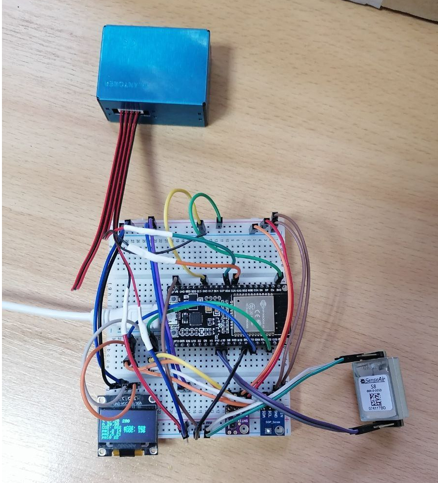

# airmonitor

**Проблема:** .

**Актуальность:** .

**Объект:** .

**Предмет:** .

**Цель:** Создать систему мониторинга качества воздуха в реальном времени. Проект должен состоять из устройства, отслеживающее данные о параметрах водуха, и веб-приложения, визуализирующее данные.

**Задачи:**

1. Проанализировать существующие веб-приложения или сайты, специализирующиеся на мониторинге параметров или качества воздуха.
2. Создать устройство, отслеживающее данные о параметрах водуха.
3. Реализовать логику отправки данных в базу данных.
4. Сделать дизайн веб-приложения.
5. Разработать frontend и backend часть приложения.

## Глоссарий

1. **Веб-приложение** - приложение, которое разработано для интернет браузеров. Отличается от сайта наличием большого количества динамической логики.
2. **SPA** (Single Page Application) - тип веб-приложения, в котором существует только один .html файл, подключающий JavaScript приложение. Все страницы, которые бы могли присутствовать на сайте, в веб-приложении реализованы на JavaScript.
3. **API** (Application Programming Interface) - набор способов и правил, по которым различные программы общаются между собой и обмениваются данными.
4. **Frontend** - клиентская часть продукта (интерфейс, с которым взаимодействует пользователь).
5. **Backend** - серверная часть продукта, реализующая, в первую очередь, защиту данных и API продукта.
6. **VDS** (Virtual Dedicated Server) - услуга виртуального хостинга, при которой клиенту выделяется виртуальный сервер целиком с полными административными правами, которые дают возможность установить на сервер любое программное обеспечение.
7. **DAL** (Data Access layer) - слой приложения, обеспечивающий доступ к данным, хранящихся, например, в базе данных.
8. **BLL** (Business Logic Layer) слой приложения, инкапсулирующий всю бизнес-логику.
9. **UI** (User Interface) - слой приложения, реализующий пользовательский интерфейс.
10.   **REST API** (Representational State Transfer) - это архитектурный подход, который устанавливает ограничения для API: как они должны быть устроены и какие функции поддерживать. Отличительной особенностью REST API является то, что он позволяют наилучшим образом использовать протокол HTTP.
11.   **WebSocket** - протокол связи поверх TCP-соединения, предназначенный для обмена сообщениями между браузером и веб-сервером, используя постоянное соединение.
12.   **GitHub** - крупнейший сервис для хостинга IT-проектов и их совместной разработки.
13.   **GitHub Pages** - часть платформы GitHub, предоставляющая услуги хостинг-провайдера.
14.   **Деплой, развёртывание** - процесс публикации определённой части или всего приложения на сервере.

## Устройство

## Веб-приложение

Ссылка на веб-приложение, размещённое на GitHub Pages: [https://frintest.github.io/airmonitor-client/](https://frintest.github.io/airmonitor-client/). 
Ссылка на веб-приложение, размещённое на vds. [https://airmonitor.servermc.ru/](https://airmonitor.servermc.ru/)

Ссылка на github frontend части приложения: https://github.com/Frintest/airmonitor-client. 
Ссылка на github backend части приложения: https://github.com/Frintest/airmonitor-server.

### Функционал

Перейдя на веб-приложение, вы попадаете на страницу описания проекта. В верхнем меню расположены 3 ссылки:

1. Описание проекта
2. Мониторинг
3. Руководство

#### Мониторинг

Страница содержит "блоки" параметров воздуха. Данные обновляются автоматически без перезагрузки страницы. Нажав на конкретный блок вы перейдёте на страницу этого параметра.

#### Страница параметра воздуха.

Страница содержит:

1. Значение параметра. Оно обновляется автоматически без перезагрузки страницы.
2. Стандарты качества этого параметра, разделённые на уровни опасности. Если параметр воздуха не нуждается в стандарте, они будут отсутствовать.
3. Интерфейс выбора дат. Нажав на иконку календаря открывается модальное окно. Можно выбрать один из диапазонов дат:

   1. Пользовательский
   2. Последний час
   3. Посдние 24 часа
   4. Последние 30 дней
   5. Последний год

Диапазон, соответствующий всему периоду работы устройства отсутствует, из-за большого количества значений параметра. Их отображение не целесообразно.
Выбрав диапазон дат, можно настроить интервал между записями значений параметра в базе данных. Существует минимальный интервал между записями равный 2 минутам. Выбрать интервал меньше этого значения не получится. Это ограничесние связано с тем, что устройство записывает значения в базу данных приблизительно раз в 2 минуты.

Выбрав пользотельский интервал, отобразится 2 календаря. Первый календарь отвечает за выбор начальной даты диапазона. Второй календарь - конечной. В календарях присутствует ограничение на минимально и максимально возможную для выбора дату. Вы не сможете выбрать дату, которая меньше, чем дата первой записи в базе данных, дату, которая больше, чем дата последней записи в базе данных.
Нажав на кнопку, с иконкой стрелки, повёрнутой влево, в верхней части календаря, вы перейдёте на предыдущий, возможный для выбора месяц.
Нажав на кнопку, с иконкой стрелки, повёрнутой вправо, в верхней части календаря, вы перейдёте на следующий, возможный для выбора месяц.
Нажав на центральную кнопку, в верхней части календаря, отобразится интерфейс выбора месяца в текущем году. Тут также присутствуют ограничесния на минимально и максимально возможный выбор месяца. Если вы передумали изменяться месяц, нажмите на текущий месяц и вам отобразится классический вид календаря.
Чтобы выбрать число месяца или месяц нажмите на него. Вы не сможете выбрать дату на первом календаре, большую, чем выбранная дата на втором календаре. По умолчанию, текущее число месяца и сам месяц обозначены голубой рамкой. Они не являются выбраннными. Выбрав дату в первом и во втором календаре нажмите кнопку "Сохранить", для отображения графика.

### Возможные баги, проблемы с отображение интерфейса, и т.д.

1. При нажатии кнопки "Сохранить" в интерфейсе выбора календаря, отобразится интерфейс графика. Шрифт для осей календаря, и всплывающей подсказки, при наведении на столбец графика - может не соответствовать основному шрифту веб-приложения. Вместо него применится шрифт с засечками.

2. Устройство может работать не исправно, например, параметры TVOC и CO2 могут достигать огромных значений.

### Frontend

Frontend часть написана на библиотеке на экосистеме react. Архитектурно приложение разделено на 3 слоя:

1. **DAL** - Реализован библиотекой socket.io-client.
2. **BLL** - Реализован библиотекой redux.
3. **UI** - Реализован библиотекой react.

Клиентская часть приложения является SPA, поэтому данные на сайте изменяются без перезагрузки страницы.

Подготовка проекта к развёртыванию на сервере осуществляется библиотекой webpack. Происходит сборка модулей, в единые файлы (Все .js файлы будут собраны в один .js файл, и т.д.), с их последующей мининизацией.

### Backend

Серверная часть приложения написана на ванильном nodejs. Для работы с базой данных MySQL я использую библиотеку mysql2. Сборка backend части приложения не осуществляется.

### База данных

В качестве базы данных я использую MySQL.

### API

Приложение отображает данные в реальном времени. По этой причине я отказался от использования классического способа описания API приложения - REST API, и использовал Websocket API, предоставляемой библиотекой socket.io.

### Деплой

Развёртывание frontend и backend части приложения на сервере осуществляется сервисом GitHub Actions. Он исполняет .yml конфиг, в котором прописаны правила сборки проекта и его дальнейшего деплоя.

Backend часть попадает на vds и точка входа приложения автоматически перезапускается. Для автономной работы приложения я использую инструмент pm2.

Развёртывание frontend части происходит на том же vds сервере что и backend часть, а также на GitHub Pages.
